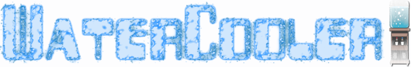

Overview
========
`water-cooler` is a tool to remind you to drink water.  It is ~~inspired by~~ a
blatant rip-off of [thirsty.sh](https://github.com/kalbhor/thirsty).

`thirsty.sh` is nice tool - I found it tremendously improved my water
consumption throughout the day.  However, being a simple shell script, it had
some limitations - namely that it wasn't convenient to integrate into non-shell
environment (_the blasphemy_!)

Screenshot
==========

Installation
============
 1. Install stack (https://docs.haskellstack.org/en/stable/README/)
 2. `stack config`  -- first time after stack installation only
 3. `stack build`
 4. `stack test`    -- optional, if you want to run the tests
 5. `stack install` -- optional, if you want install it

Usage
=====

Check if it is time for a drink
-------------------------------
`$ water-cooler status`

If it is time for a drink, this command will print "You're thirsty."  Otherwise
it will print nothing and simply return.

This command can be embedded into your shell prompt/status, window manager, or
anywhere else that can call a program.

Drink some water
----------------
`$ water-cooler drink [optional drink size]`

Drink size can be one of:

* `sip` - A small drink
* `swallow` - An average size drink
* `gulp` - A big drink
* `fake` - You didn't really drink, but you want to lie to the program that you did.

The optional flag `--wait N` can be used to set a custom time, where N is the
number of seconds until the next drink.
The default wait time until the next drink is 1200 seconds, or 20 minutes.

Check time until the next drink
-------------------------------
`$ water-cooler next`

The until the next drink is displayed in seconds.

You are not thirsty
-------------------
`$ water-cooler not-thirsty`

Indicates you are not thirsty and will reset the drink reminder.
The next drink reminder will be issued in 600 seconds, or 10 minutes.

The optional flag `--wait N` can be used to override the number of seconds
until the next drink reminder.

Out of water
------------
`$ water-cooler no-water`

Indicates that you are out of water.  water-cooler will suggest getting a
refill and the next drink reminder will be issued in 3600 seconds, or 1 hour.

The optional flag `--wait N` can be used to override the number of seconds
until the next drink reminder.

Options
=======

|                |                    |
+----------------+--------------------+
|`--help`        | Display help       |
|`--version`     | Display version    |
| `--wait N`     | Set a custom value for the number of seconds for the next drink.  Effects only `drink`, `not-thirsty`, and `no-water` commands. |
|`--env-cooler`  |  Specify a custom cooler file, must be an absolute path.  |
|`--env-history` |  Specify a custom history file, must be an absolute path. |

Acknowledgements
================
[Thirsty](https://github.com/kalbhor/thirsty)
